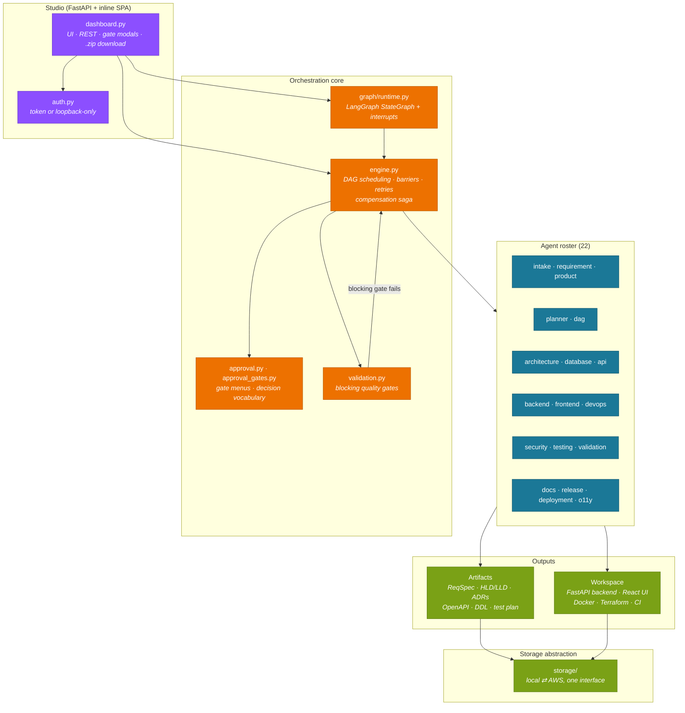

# Forge — Architecture

Two views of the same system: the **application** (agents, gates, orchestration)
and the **AWS infrastructure** it runs on. Resource names below use the
`${project}-${environment}` prefix from
[`variables.tf`](../deploy/terraform/variables.tf), which defaults to `forge-dev`.

---

## 1. AWS infrastructure

The load-bearing property is that **nothing runs while nobody is looking**. There
is no NAT gateway, no always-on container, and no idle database — the control
plane is a Lambda that cold-starts on request, and workflow execution is a
Fargate task that exists only between two human decisions.

```mermaid
flowchart TB
    subgraph client["👤 Operator"]
        BROWSER["Browser<br/><i>Forge Studio UI</i>"]
    end

    subgraph aws["☁️ AWS — ap-south-1"]
        subgraph edge["Edge"]
            APIGW["<b>Amazon API Gateway</b><br/>HTTP API · $default stage<br/><code>forge-dev-studio</code>"]
        end

        subgraph control["Control plane — serverless"]
            LAMBDA["<b>AWS Lambda</b><br/>container image + Web Adapter<br/><code>forge-dev-api</code><br/><i>1 GB · 30 s</i>"]
            TOKENFN["<b>AWS Lambda</b><br/><code>forge-dev-register-token</code><br/><i>gate token + state read</i>"]
        end

        subgraph orch["Orchestration"]
            SFN["<b>AWS Step Functions</b><br/>STANDARD workflow<br/><code>forge-dev-workflow</code>"]
        end

        subgraph compute["Execution — one task per segment"]
            ECS["<b>Amazon ECS on AWS Fargate</b><br/>cluster <code>forge-dev-workers</code><br/>task <code>forge-dev-worker</code><br/><i>FARGATE_SPOT</i>"]
        end

        subgraph data["State & artifacts"]
            S3[("<b>Amazon S3</b><br/><code>forge-dev-artifacts-&lt;acct&gt;</code><br/><i>versioned · SSE · lifecycle</i>")]
            DDB[("<b>Amazon DynamoDB</b><br/><code>forge-dev-workflows</code><br/><code>forge-dev-checkpoints</code><br/><code>forge-dev-memory</code><br/><i>on-demand</i>")]
        end

        subgraph sec["Config & images"]
            SSM["<b>AWS Systems Manager</b><br/>Parameter Store · SecureString<br/><code>/forge-dev/llm-api-key</code><br/><code>/forge-dev/api-token</code>"]
            ECR["<b>Amazon ECR</b><br/><code>forge-dev-api</code><br/><code>forge-dev-worker</code>"]
        end

        CW["<b>Amazon CloudWatch</b><br/>Logs · metrics"]
        IAM["<b>AWS IAM</b><br/>task, execution & state roles"]
    end

    LLM["<b>OpenAI API</b><br/><i>gpt-4o-mini</i>"]

    BROWSER -- "HTTPS + bearer token" --> APIGW
    APIGW -- "AWS_PROXY · ANY /{proxy+}" --> LAMBDA
    LAMBDA -- "StartExecution<br/>SendTaskSuccess" --> SFN
    LAMBDA -- "read/write run state" --> DDB
    LAMBDA -- "read artifacts · build .zip" --> S3
    LAMBDA -- "GetParameter" --> SSM

    SFN -- "ecs:runTask.sync" --> ECS
    SFN -- "read_state / register token" --> TOKENFN
    TOKENFN -- "task token" --> DDB

    ECS -- "checkpoints · documents" --> DDB
    ECS -- "artifacts · generated source" --> S3
    ECS -- "FORGE_LLM_API_KEY (secret)" --> SSM
    ECS -- "HTTPS egress (no NAT)" --> LLM

    ECR -. "image pull" .-> LAMBDA
    ECR -. "image pull" .-> ECS
    LAMBDA -.-> CW
    ECS -.-> CW
    SFN -.-> CW
    IAM -.-> LAMBDA
    IAM -.-> ECS
    IAM -.-> SFN

    classDef svcCompute fill:#ED7100,stroke:#B85C00,color:#fff
    classDef svcStorage fill:#7AA116,stroke:#5A7A10,color:#fff
    classDef svcNetwork fill:#8C4FFF,stroke:#6B3BCC,color:#fff
    classDef svcMgmt fill:#E7157B,stroke:#B31060,color:#fff
    classDef svcExt fill:#232F3E,stroke:#000,color:#fff

    class LAMBDA,TOKENFN,ECS svcCompute
    class S3,DDB svcStorage
    class APIGW svcNetwork
    class SFN,SSM,ECR,CW,IAM svcMgmt
    class LLM,BROWSER svcExt
```



### Why these services

| Choice | Reason |
|---|---|
| Lambda + Web Adapter for the API | Runs `uvicorn main:app` unmodified — the same image runs locally with `docker run`. Scales to zero. |
| Step Functions for orchestration | `waitForTaskToken` parks a run at a human gate at **zero cost** for as long as it waits. |
| Fargate for execution | A segment needs minutes and a real filesystem for codegen; Lambda's 15-minute ceiling and read-only FS do not fit. |
| DynamoDB + S3, not RDS | No idle cost, and the workload is key-lookup documents plus blobs. |
| Parameter Store, not Secrets Manager | Standard parameters are free; nothing here needs managed rotation. |
| Public IP, no NAT gateway | A NAT would cost more than every other line item combined. The task security group is egress-only. |

### Request path

1. Browser → API Gateway → Lambda. `ANY /` and `ANY /{proxy+}` both target the
   same function, so the HTML page and every `/api/*` call are one integration.
2. Uploading a document starts a Step Functions execution and returns immediately.
3. `RunSegment` launches a Fargate task that ticks the engine until a gate.
4. `CheckWorkflowState` reads the stored status; if `PAUSED`, `AwaitApproval`
   registers a task token and the execution parks.
5. The operator answers the gate. The API **records the decision durably**, then
   releases the token; `ResumeSegment` launches the next task.
6. Repeat until terminal. Artifacts land in S3; the Studio reads them back.

---

## 2. Application architecture



### The SDLC pipeline and its human gates

Gates in **bold** always pause for a human, even in demo mode
([`approval_gates.py`](../forge/approval_gates.py)).

```mermaid
flowchart LR
    INTAKE["intake<br/>capture"] --> REQ["req<br/>analyze"]
    REQ --> CLARIFY{{"<b>approval.clarify</b>"}}
    CLARIFY --> PLAN["plan<br/>decompose"]
    PLAN --> GPLAN{{"approval.plan"}}
    GPLAN --> ARCH["arch<br/>HLD · LLD · ADRs"]
    ARCH --> GARCH{{"approval.arch"}}
    GARCH --> DB["db<br/>schema · DDL"]
    DB --> GDB{{"approval.db"}}
    GDB --> API["api<br/>OpenAPI"]
    API --> GAPI{{"approval.api"}}
    GAPI --> FIGMA{{"<b>approval.figma</b>"}}
    FIGMA --> CODE["backend · frontend<br/>devops codegen"]
    CODE --> GCODE{{"<b>approval.coding</b>"}}
    GCODE --> TEST["testing · security<br/>validation"]
    TEST --> GATE{"validate<br/>pre_release"}
    GATE -- pass --> REL["release<br/>docs · summary"]
    GATE -- "blocking gate fails" --> COMP["compensation saga<br/><i>tear down generated tree</i>"]

    classDef gate fill:#E7157B,stroke:#B31060,color:#fff
    classDef work fill:#ED7100,stroke:#B85C00,color:#fff
    classDef bad fill:#D13212,stroke:#A02810,color:#fff

    class CLARIFY,GPLAN,GARCH,GDB,GAPI,FIGMA,GCODE gate
    class INTAKE,REQ,PLAN,ARCH,DB,API,CODE,TEST,REL work
    class COMP bad
```



A failing **blocking** gate does not merely stop the run — it triggers the
compensation saga, which removes the generated backend, frontend, and infra so a
half-validated tree is never left behind as a deliverable.

---

## 3. Local vs AWS

The same code runs both ways; only the environment differs.

| Concern | Local | AWS |
|---|---|---|
| `FORGE_STORAGE` | `local` — the `var/` tree | `aws` — S3 + DynamoDB |
| `FORGE_EXECUTION` | `thread` — a daemon thread | `stepfunctions` — Fargate per segment |
| API host | `uvicorn main:app` | Lambda + Web Adapter |
| Auth | loopback-only, no token | bearer token required |
| Secrets | `.env` | Parameter Store, resolved at cold start |

`.env` is **local only** — it is never copied into the images and never read on
AWS. Deployed configuration comes from `local.forge_env` in
[`compute.tf`](../deploy/terraform/compute.tf).

---

## 4. Downloading the workspace

`GET /api/workflows/{id}/download` streams a zip built **through the object
store**, so it behaves identically on both backends — on AWS the API Lambda never
ran the workflow and holds no local copy.

The archive carries the **generated source tree only**. Design artifacts (ReqSpec,
HLD/LLD, OpenAPI, DDL) are excluded: the Studio renders those in its own sections,
and this download is the deliverable a developer opens in an editor. Paths sit at
the archive root, so it unpacks straight into a project directory.

```
backend/          FastAPI app, routes, models, tests
frontend/         React UI wired to the generated API
infra/            Dockerfiles, compose, Terraform
.github/workflows/ci.yml, cd.yml
```

A run whose codegen has not happened yet — or whose tree was rolled back by a
failed blocking gate — returns **409** with an explanation rather than an empty
zip.
